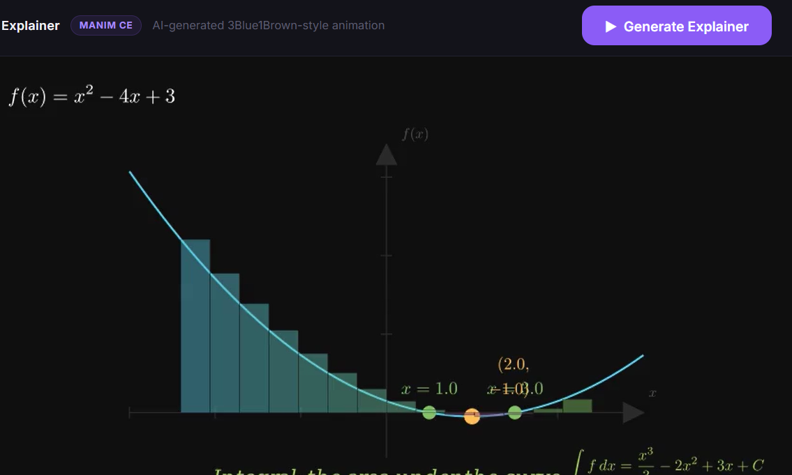

# Numera

> **Transform mathematics into beautiful AI-generated animations.**

Numera is an AI-powered mathematics visualization engine that converts mathematical expressions and natural language into animated visual explanations. By combining symbolic mathematics, large language models, and Manim, Numera generates mathematically accurate educational animations through an automated AI pipeline.

---

## Features

-  AI-powered mathematical reasoning
-  Automatic Manim animation generation
- Symbolic mathematics using SymPy
-  Mathematical validation before rendering
-  Self-healing code generation pipeline
-  Secure Docker-based rendering
-  Intelligent rendering fallback
-  SQLite job tracking and caching
-  Graphing support
- Support for algebra, calculus, functions, derivatives, integrals, and many high-school mathematics topics

---

## Example Usage

Generate a graph:

```bash
numera "Plot the quadratic equation x^2 - 4x + 3"
```

Differentiate a function:

```bash
numera "Differentiate sin(x)"
```

Integrate an expression:


$$
x^2 - 4x + 3
$$

<p align="center">
  
</p>

---

# Installation

Clone the repository:

```bash
git clone https://github.com/Mubashirshahhh/Numera.git
cd Numera
```

Create a virtual environment:

```bash
python -m venv .venv
```

Activate it.

### Linux / macOS

```bash
source .venv/bin/activate
```

### Windows

```bash
.venv\Scripts\activate
```

Install Numera:

```bash
pip install -e .
```

After the project is published:

```bash
pip install numera
```

---

# Requirements

- Python 3.11+
- Docker
- FFmpeg
- LaTeX (recommended for higher quality mathematical rendering)

---

# How Numera Works

1. The user submits a mathematical expression or natural language prompt.
2. SymPy parses and validates the mathematics.
3. The AI planner generates optimized Manim animation code.
4. Mathematical invariants are checked for correctness.
5. Invalid generations are automatically repaired.
6. The animation is rendered securely inside Docker.
7. The final MP4 animation is returned to the user.

---

# Project Structure

```
Numera/
├── pyproject.toml
├── README.md
├── requirements.txt
├── LICENSE
├── .gitignore
│
├── numera/
│   ├── __init__.py
│   ├── __main__.py
│   ├── cli.py
│   └── pipeline.py
│
└── tests/
```

---

# Roadmap

- Interactive CLI
- Web application
- AI-powered mathematical tutoring
- Additional mathematical domains
- Faster rendering pipeline
- Plugin architecture
- PyPI release
- Cloud rendering support

---

# Technology Stack

- Python
- SymPy
- Manim Community
- OpenAI API
- Docker
- SQLite
- FFmpeg

---

# Development Workflow

Numera was built using an AI-assisted development workflow that combines symbolic mathematics with large language models.

### OpenAI API

The OpenAI API powers Numera's AI reasoning pipeline. It is responsible for:

- Understanding mathematical prompts written in natural language.
- Generating Manim animation code.
- Repairing invalid generations through iterative refinement.
- Producing mathematically structured outputs for the rendering pipeline.

### OpenAI Codex

OpenAI Codex was used during development to help architect the Python codebase, including:

- Designing the overall project structure.
- Organizing the CLI and pipeline architecture.
- Refactoring modules into a maintainable package layout.
- Improving code organization and implementation patterns.

### Replit AI

Replit AI was used as a development assistant to improve implementation quality by helping:

- Debug Python exceptions.
- Resolve dependency and package issues.
- Fix rendering pipeline bugs.
- Troubleshoot Docker and environment configuration.
- Identify integration problems between SymPy, Manim, and the AI pipeline.

# License

Licensed under the **GNU General Public License v3.0 (GPL-3.0)**.

---

# Author

## Mubashir Shah

GitHub:
https://github.com/Mubashirshahhh

---

# Contributing

Contributions, feature requests, and bug reports are welcome.

If you'd like to contribute:

1. Fork the repository.
2. Create a new branch.
3. Make your changes.
4. Submit a Pull Request.

Issues and suggestions are always appreciated.

---

## Vision

Numera aims to make mathematics intuitive through AI-generated visual explanations. Rather than reading static equations, students can watch mathematics come to life through animations generated automatically from simple prompts.
